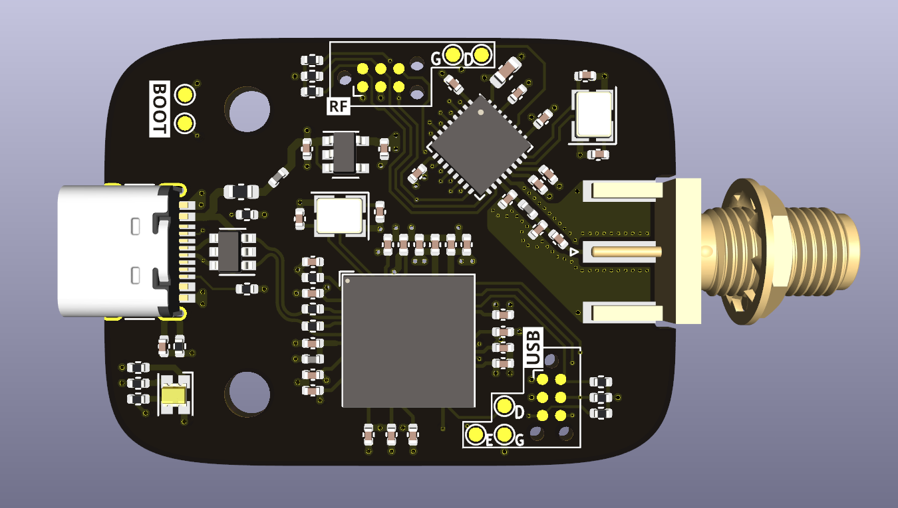

:hide-toc:

******************
russian-woodpecker
******************
*russian-woodpecker* is a usb HS (capable of 8kHz polling rate) 2.4GHz radio receiver dongle for use with input devices

State of the project
====================

First prototype.

.. admonition:: Roadmap

   - Initial design |:+1:|
   - First prototype manufactured and assembled |:hammer:|
   - Barebones firmware support
   - Documentation |:hammer:|
   - Hardware improvements / V1

   ========== ================
   |:+1:|     Done!
   |:hammer:| Work in progress
   ========== ================

Specifications
==============

* 8 kHz polling rate suppor
* 2.4GHz radio
* smol, but not that smol

Hardware
========

* ATSAMS3U MCU as main controller
* nrf52810 MCU as radio receiver
   * SPI connection between MCUs
* USB C connector
* External antenna connector

Firmware
========

The plan:

The device will need two firmwares, nrf52 will be updated through a spi bootloader by the main mcu, which will be updated through hid

Both will include debug header

.. toctree::
   :caption: External Links
   :hidden:

   Firmware <https://openinput.readthedocs.io>
   Issue Tracker <https://github.com/openinput-fw/russian-woodpecker/issues>
